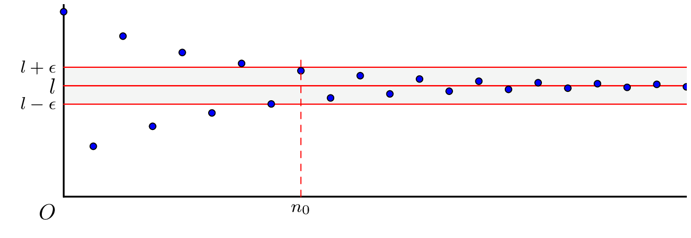

------

### Définition

:::: {.bloc .def}
Définition :  

Soit $(u_n)$ une suite réelle. On dit que la suite $(u_n)$ **converge vers un réel $l$** ou admet $l$ pour limite lorsque :
$$\forall \epsilon > 0, \, \exists n_0 \in \N, \, \forall n \in \N, \, (n \geqslant n_0 \Rightarrow |u_n - l| < \epsilon)$$

On note alors :
$$\lim_{n \to +\infty} u_n = l$$
Une suite qui ne converge pas est dite **divergente**.
:::

::: {.bloc .rem}
Remarque :  

Cela signifie que tout intervalle ouvert contenant $l$ contient tous les termes de la suite $(u_n)$ à partir d'un certain rang (autrement dit, il n'y a qu'un nombre fini de termes à l'extérieur de cet intervalle).

**Interprétation graphique**  
Si on représente une suite convergente vers $l$ par un nuage de points dans un repère, à partir d’un certain rang $n_0$, tous les points sont dans la bande délimitée par les droites d’équation $y= l -\epsilon$ et $y=l + \epsilon$.

   

  

 

:::

::: {.bloc .ex}

Exemple : Utilisation de la définition $\epsilon$ 

1. Montrons que la suite $(u_n)$ définie par $u_n = \dfrac{1}{\sqrt{n+1}}$ converge vers $0$.

Afficher la correction :

On a :
$$\abs{\dfrac{1}{\sqrt{n+1}} - 0} < \epsilon \Longleftrightarrow \dfrac{1}{\sqrt{n+1}} < \epsilon \Longleftrightarrow \dfrac{1}{\epsilon^2} < n+1 \Longleftrightarrow n > \dfrac{1}{\epsilon^2} - 1$$
Soit $n_0 = \lfloor \dfrac{1}{\epsilon^2} \rfloor + 1$. On a ainsi :
$$\forall n \in \N, \, n \geqslant n_0 \Longrightarrow \dfrac{1}{\sqrt{n+1}} < \epsilon$$
On vient de démontrer que la suite $(u_n)$ est convergente, et on note : $\lim_{n \to +\infty} \dfrac{1}{\sqrt{n+1}} = 0$.

2. Prouvons la convergence de $v_n = \dfrac{2\sqrt{n+1}+1}{\sqrt{n+1}}$.

Afficher la correction :

Pour tout $n \in \N$,
$$v_n = \dfrac{2\sqrt{n+1}}{\sqrt{n+1}} + \dfrac{1}{\sqrt{n+1}} = 2 + u_n$$
Or, $(u_n)$ converge vers $0$, donc :
$$\forall \epsilon > 0, \, \exists n_0 \in \N, \, \forall n \in \N, \, (n > n_0 \Rightarrow \abs{u_n} < \epsilon)$$
D'où $-\epsilon < u_n < \epsilon$. On en déduit : $2 - \epsilon < v_n < 2 + \epsilon$.  

Ainsi, $\forall \epsilon > 0, \, \exists n_0 \in \N, \, \forall n \in \N, \, (n > n_0 \Rightarrow \abs{v_n - 2} < \epsilon)$.  

La suite $(v_n)$ converge vers $2$.

:::

::: {.bloc .ex}

Exemple : Divergence de $(-1)^n$ 

On considère la suite $(u_n)$ définie par $u_n = (-1)^n$. Montrons que cette suite diverge.

Afficher la correction :

Supposons par l'absurde que la suite converge vers un réel $l$. Soit $\epsilon = 1$, il existe $n_0 \in \N$ tel que :
$$n \geqslant n_0 \Rightarrow \abs{(-1)^n - l} < 1$$
* Si $n = 2k$ : $\abs{1 - l} < 1 \Longleftrightarrow 0 < l < 2$.
* Si $n = 2k+1$ : $\abs{-1 - l} < 1 \Longleftrightarrow -2 < l < 0$.

L'ensemble des limites possibles est $]0, 2[ \cap ]-2, 0[ = \emptyset$. Contradiction. La suite diverge.

:::

::: {.bloc .thm}
Théorème :  

Toute suite convergente est bornée.
:::

Démonstration :

Soit $(u_n)$ une suite convergente vers $l$. 

Pour $\epsilon = 1$, il existe $n_0 \in \N$ tel que pour $n > n_0$, $\abs{u_n - l} < 1$.

D'après l'inégalité triangulaire : $
$\abs{u_n} = \abs{u_n - l + l} \leqslant \abs{u_n - l} + \abs{l} < 1 + \abs{l}$$

En posant $$M = \max(\abs{u_0}, \dots, \abs{u_{n_0}}, 1 + \abs{l})$$

on a $\forall n \in \N, \abs{u_n} \leqslant M$.

::: {.bloc .rem}
Remarque :  

Pour montrer qu'une suite ne converge pas, on peut montrer qu'elle n'est pas bornée.
:::

::: {.bloc .ex}

Exemple : Suite non majorée 

Soit la suite $(u_n)$ définie par $u_n = 3n^2 + 1$. Montrons qu'elle diverge.

Afficher la correction :

Supposons par l'absurde que $(u_n)$ est majorée par $L$.  
Alors pour tout $n$, $3n^2+1 \leqslant L$, soit $n \leqslant \sqrt{\dfrac{L-1}{3}}$.   
C'est impossible car $\N$ n'est pas majoré. La suite n'étant pas bornée, elle ne peut pas converger.

:::

::: {.bloc .thm}
Théorème :  

Si une suite $(u_n)$ converge vers un réel $l$, alors ce réel $l$ est unique.
:::

Démonstration :

Supposons que $(u_n)$ converge vers $l$ et $l'$. Soit $\epsilon = \dfrac{\abs{l-l'}}{3}$.  

Il existe un rang $N$ à partir duquel $$\abs{u_n - l} \leqslant \epsilon$ et $\abs{u_n - l'} \leqslant \epsilon$$
Par inégalité triangulaire :
$$\abs{l - l'} = \abs{l - u_n + u_n - l'} \leqslant \abs{u_n - l} + \abs{u_n - l'} \leqslant \dfrac{2\abs{l-l'}}{3}$$

Ceci implique $\abs{l-l'} = 0$, donc $l=l'$.

::: {.bloc .ex}

Exemple : Étude de $\cos(n\pi)$ 

La suite $u_n = \cos(n\pi)$ prend alternativement les valeurs $1$ (pour $n$ pair) et $-1$ (pour $n$ impair). 

Si elle convergeait vers $l$, on aurait simultanément $l=1$ et $l=-1$ par unicité de la limite, ce qui est impossible.  

La suite diverge.
:::

::: {.bloc .thm}
Théorème (admis) :  

Soit $k \in \N^*$, alors :
$$\lim_{n \to +\infty} \dfrac{1}{n^k} = 0 \quad \text{et} \quad \lim_{n \to +\infty} \dfrac{1}{\sqrt{n}} = 0$$
:::

  <a class="prev" href="application.html">⬅️</a>
  <a class="next" href="convergence_prop.html">➡️</a>

